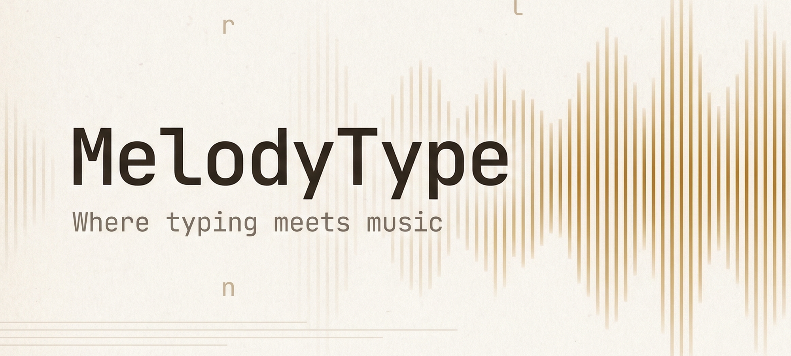
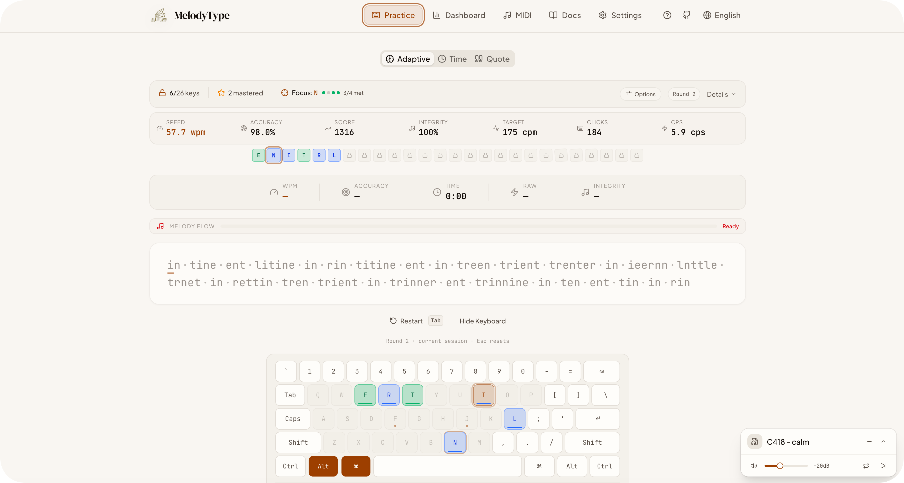
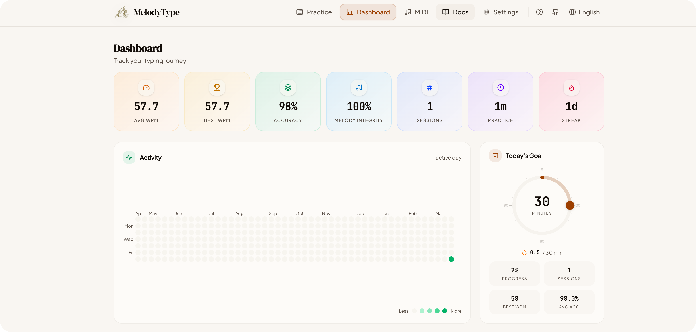
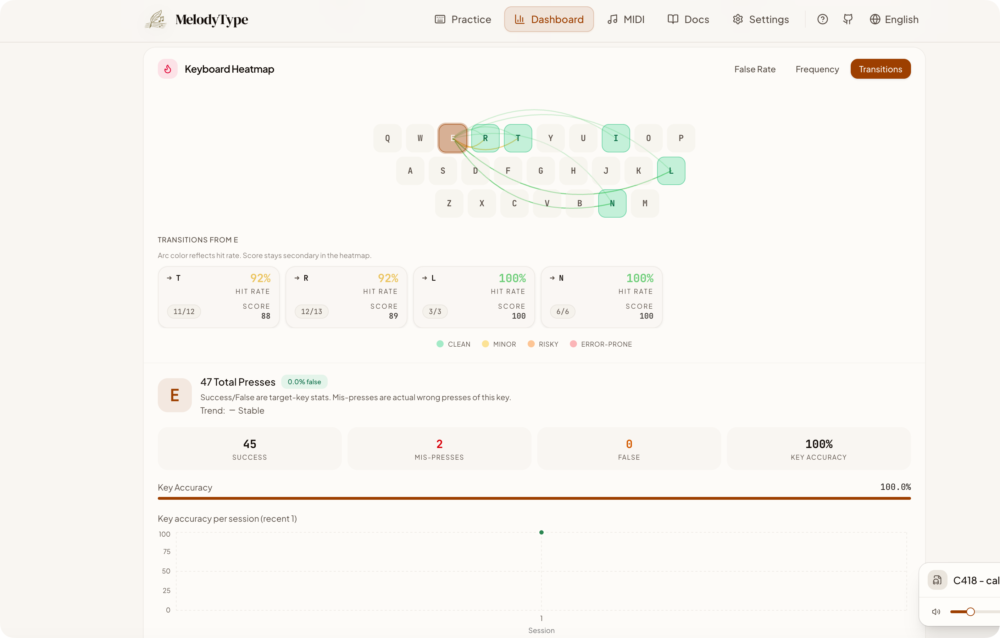
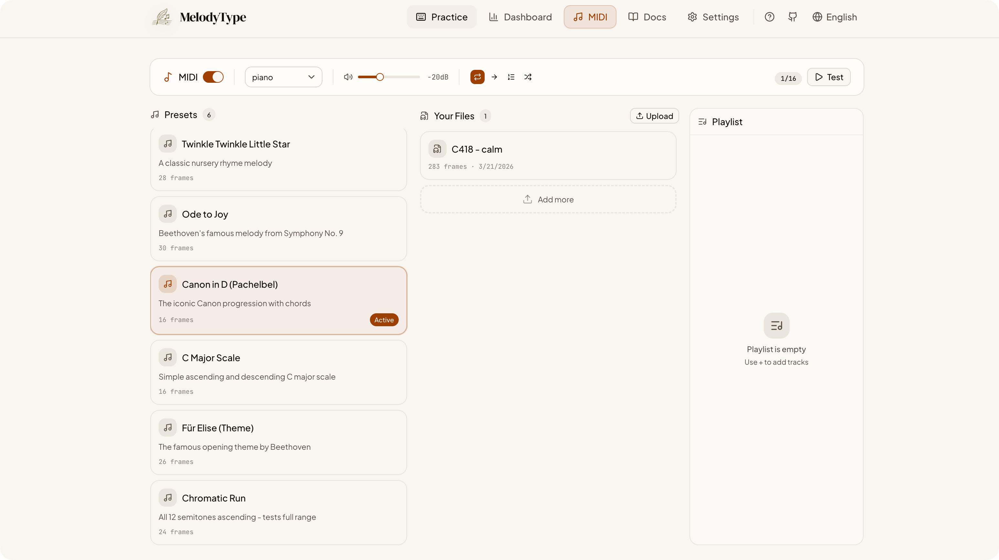

<p align="center">
  
</p>

<h1 align="center">MelodyType</h1>

<p align="center">
  <strong>Where typing meets music</strong> — A privacy-focused typing practice app that transforms every keystroke into a musical melody.
</p>

<p align="center">
  <a href="./README.zh-CN.md">English | 中文</a>
</p>

<p align="center">
  
  
  
  
  
  
</p>

<p align="center">
  <a href="https://vercel.com/new/clone?repository-url=https%3A%2F%2Fgithub.com%2Ffl0w1nd%2FMelodyType">
    
  </a>
</p>

---

MelodyType is a fully client-side web application with MIDI-driven audio feedback and comprehensive progress tracking. All data stays in your browser — no accounts, no cloud, complete privacy.

## Table of Contents

- [Features](#features)
- [Preview](#preview)
- [Tech Stack](#tech-stack)
- [Getting Started](#getting-started)
- [Project Structure](#project-structure)
- [Data & Privacy](#data--privacy)
- [License](#license)
- [Acknowledgments](#acknowledgments)

---

## Features

### Musical Typing

Every keystroke plays a note. Practice becomes performance.

- **5 Synthesizer Instruments** — Piano, Strings, Synth, Music Box, Bell
- **Custom MIDI Files** — Upload your own melodies for personalized practice
- **Built-in Presets** — Twinkle Twinkle Little Star, Ode to Joy, Canon in D, Für Elise, C Major Scale, Chromatic Run
- **Playback Modes** — Loop, once, sequential, or random
- **Playlist Support** — Build a custom playlist from presets and uploaded files with drag-to-reorder
- **Melody Flow Meter** — Real-time visual feedback on your typing rhythm
- **Floating Player** — Minimizable floating MIDI player visible on all pages

### Adaptive Learning

An intelligent practice system that adapts to your skill level, inspired by [keybr.com](https://www.keybr.com).

**Progressive Key Unlocking** — You start with the 6 most common English letters. As you master each key, new letters unlock in frequency order:

```
e → n → i → t → r → l → s → a → u → o → d → y → c → h → g → m → p → b → k → v → w → f → z → x → q → j
```

**Smart Text Generation** — Order-4 Markov chain trained on English phonetic data, producing natural-sounding pseudo-words weighted toward your weakest keys.

**Per-Key Progress Tracking** — EWMA speed, accuracy tracking, and polynomial regression to predict sessions until mastery.

**Mastery Criteria:**
- EWMA speed reaches your target CPM (default 175, configurable 75–750)
- At least 35 correct keystrokes recorded
- Recent accuracy ≥ 90% (decay-weighted)
- Lifetime accuracy ≥ 88%

**Continuous Sessions** — Rounds flow seamlessly. Press `Esc` to pause and review your progress.

### Practice Modes

| Mode | Description |
|------|-------------|
| **Adaptive** | Continuous sessions with progressive key unlocking and smart text generation |
| **Time** | Structured level system with 4 tiers, letter grades (F–S), and progress tracking |
| **Quote** | Type famous quotes for variety and natural language practice |

### Dashboard

Track your progress with detailed analytics:

- **Stats Overview** — 7 hero metric cards with hover tooltips
- **Activity Heatmap** — GitHub-style daily practice activity
- **Daily Goal Ring** — Interactive draggable ring for daily practice targets
- **WPM & Accuracy Charts** — Aggregated trends with time range selector
- **Keyboard Heatmap** — False Rate, Frequency, and Transitions views
- **Key Detail Panel** — Per-key statistics and learning trend
- **Adaptive Progress Card** — Unlock status, confidence map, session averages
- **Session History** — Recent sessions filtered by mode

---

## Preview

<p align="center">
  
  <br />
  <em>Adaptive practice with real-time metrics, virtual keyboard, and MIDI playback</em>
</p>

<p align="center">
  
  <br />
  <em>Dashboard with stats overview, activity heatmap, and daily goal tracking</em>
</p>

<p align="center">
  
  <br />
  <em>Keyboard heatmap with transition arcs and per-key detail analytics</em>
</p>

<p align="center">
  
  <br />
  <em>MIDI management — instruments, presets, uploads, and playlist</em>
</p>

---

## Tech Stack

| Layer | Technology |
|-------|-----------|
| Framework | [React](https://react.dev) 19 |
| Language | [TypeScript](https://www.typescriptlang.org) 5.9 |
| Build Tool | [Vite](https://vite.dev) 8 |
| Styling | [Tailwind CSS](https://tailwindcss.com) 4 |
| UI Components | [shadcn/ui](https://ui.shadcn.com) + [Base UI](https://base-ui.com) |
| Local Storage | [Dexie.js](https://dexie.org) (IndexedDB) |
| Audio | [Tone.js](https://tonejs.github.io) |
| MIDI Parsing | [@tonejs/midi](https://github.com/Tonejs/Midi) |
| Charts | [Recharts](https://recharts.org) |
| Animation | [Framer Motion](https://www.framer.com/motion/) |
| Routing | [React Router](https://reactrouter.com) |
| Testing | [Vitest](https://vitest.dev) |

---

## Getting Started

### Prerequisites

- [Node.js](https://nodejs.org) ≥ 18
- [pnpm](https://pnpm.io)

### Installation

```bash
git clone https://github.com/fl0w1nd/MelodyType.git
cd MelodyType
pnpm install
```

### Development

```bash
pnpm dev        # Start dev server at http://localhost:5173
pnpm build      # Production build
pnpm preview    # Preview production build
pnpm lint       # Run ESLint
npx vitest run  # Run tests
```

> **Note**: No `.env` file or API keys required — the app is entirely self-contained.

---

## Project Structure

```
src/
├── engine/                         # Core business logic
│   ├── typing/                     # Typing engine (Markov chain, adaptive, math)
│   ├── midi/                       # MIDI audio system (Tone.js, scheduling)
│   └── practice/                   # Session orchestration & persistence
├── components/                     # React components
│   ├── practice/                   # Practice interface
│   ├── dashboard/                  # Dashboard & analytics
│   ├── layout/                     # App shell & background
│   └── ui/                         # shadcn/ui primitives
├── pages/                          # Page components (lazy-loaded)
├── lib/                            # Utilities (DB, settings, helpers)
├── App.tsx                         # Router & providers
├── main.tsx                        # Entry point
└── index.css                       # Global styles (Tailwind v4)
```

---

## Data & Privacy

- **Local-First** — All data stored in browser IndexedDB
- **No Tracking** — No analytics, no telemetry, no external requests (except Google Fonts)
- **Portable** — Export/import full JSON backups from Settings
- **Privacy** — Your typing data never leaves your browser

---

## License

[AGPL-3.0](LICENSE)

---

## Acknowledgments

- [keybr.com](https://www.keybr.com) — Inspiration for the adaptive learning algorithm
